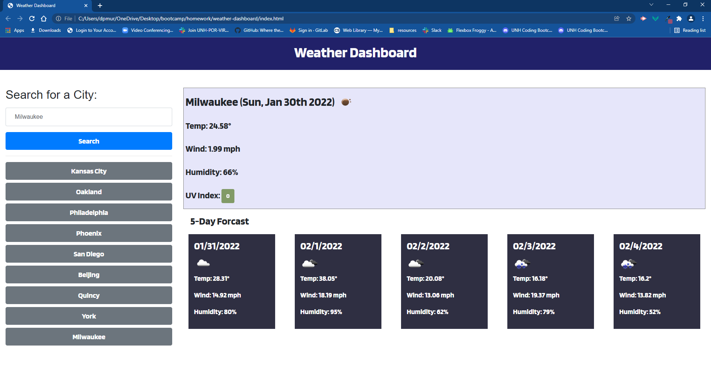

# weather-dashboard
A website that allows users to search and view current and forecasted weather in multiple cities

## Features
* The user interface is responsive
* When the user searches for a city, they are presented with current and future conditions for that city and that city is added to the search history
* When the user views the UV index, they are presented with a color that indicates whether the conditions are favorable, moderate, or severe
* When the user views the future weather conditions for that city, they are presented with with a 5-day forecast that displays the date, an icon representation of weather conditions, the temperature, the wind speed, and the humidity
* When the user clicks on a city in the search history, they are again presented with current and future conditions for that city

## Technologies

* HTML
* CSS
* JavaScipt
* Moment.js
* jQuery
* jQuery UI
* Google Fonts
* Bootstrap
* OpenWeather API

**Repositoy:** <https://github.com/dpmurphy11/weather-dashboard>

**Website:** <https://dpmurphy11.github.io/weather-dashboard/>
